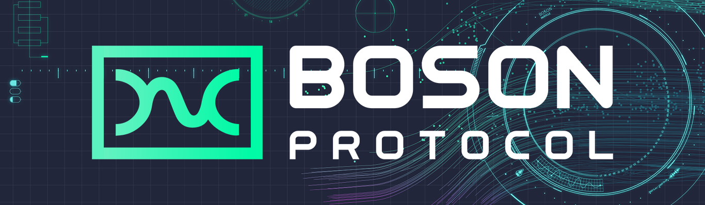

<h2 align="center">Boson Protocol dApp</h2>

<a href="https://github.com/bosonprotocol/interface/actions/workflows/ci.yaml"></a>

🛠️ **An example dApp built on top of [Boson Protocol](https://bosonprotocol.io/).**

## Environments

Each environment is deployed to Cloudflare Pages by GitHub Actions. The same bundle is
built twice per environment — once as the dApp and once as the Dispute Resolution Center —
selected by the `REACT_APP_VIEW_MODE` build variable.

| Env        | Networks          | dApp                                  | DR Center                                    |
| ---------- | ----------------- | ------------------------------------- | -------------------------------------------- |
| testing    | amoy, sepolia     | https://interface-a9d.pages.dev/      | https://boson-dr-center-testing.pages.dev/   |
| staging    | amoy, sepolia     | https://boson-dapp-staging.pages.dev/ | https://boson-dr-center-staging.pages.dev/   |
| production | polygon, ethereum | https://bosonapp.io/                  | https://disputes.bosonprotocol.io/           |

Deployments are triggered as follows:

| Env        | Trigger                                                     |
| ---------- | ----------------------------------------------------------- |
| preview    | Every pull request, as one deployment serving both view modes |
| testing    | Every push to `main`                                         |
| staging    | Publishing a GitHub Release (deploys that tag)               |
| production | Manually running the **Deploy to production** workflow with a tag |

Build-time configuration lives in GitHub: values common to all environments are
repository variables/secrets, and environment-specific values override them in the
`testing`, `staging` and `production` GitHub Environments. Every `REACT_APP_*` value is
inlined into the bundle at build time, so an unset one is not an error — it becomes an
empty string and silently disables whatever it configures. The **Check the build
configuration is complete** step in `deploy_reusable.yaml` lists the values a deployment
cannot work without and fails the run before building if any is missing; add to that list
when you add a variable the app depends on.

Each environment also needs `CF_PROJECT_DAPP` and `CF_PROJECT_DR_CENTER` variables holding
the exact Cloudflare project names (`wrangler pages project list`), plus the repository
secrets `CLOUDFLARE_API_TOKEN` and `CLOUDFLARE_ACCOUNT_ID`.

Branch protection on `main` should require the **Format, lint, types and build** job of
**CI - Interface** and the **Deploy PR preview** workflow. Required checks are matched by
name, so renaming either workflow or job detaches the rule silently.

## Local development

### Node & pnpm

The required Node version is in [`.nvmrc`](.nvmrc) — run `nvm use` (or `fnm use`) to pick it
up. The pnpm version is pinned by the `packageManager` field in `package.json`; `corepack enable`
will honour it automatically. Once that's done, the required steps to develop and test the dApp
interface locally are as follows:

1. Clone the repository: i.e. Run `git clone git@github.com:bosonprotocol/interface.git`
2. Navigate into the directory & install dependencies: i.e. Run `cd interface && pnpm install`
3. Copy the `.env.example` file to `.env` and fill out any necessary values.
4. Start the application: i.e. Run `pnpm dev`
5. Navigate to `http://localhost:3000/` in a browser.

## Contributing

We welcome contributions! The ultimate goal is for all of the Boson Protocol repositories to be fully owned by the community and contributors. Issues, pull requests, suggestions, and any sort of involvement are more than welcome.

By being in this community, you agree to the [Code of Conduct](/docs/code-of-conduct.md). Take a look at it, if you haven't already.
